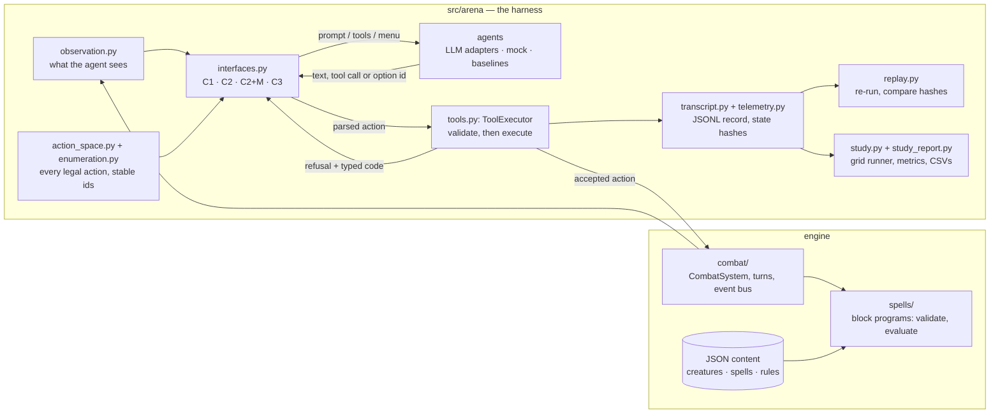

# Architecture

Arbiter Arena has two layers: a **combat engine** that knows the rules, and an
**arena** that drives the engine with agents and records what happens. The arena
depends on the engine; the engine never imports the arena.

## One decision, end to end

1. **Observe.** `observation.py` builds the acting creature's view of the battle
   (`observation.v1`). An `InformationPolicy` decides what is hidden from it.
2. **Offer.** `action_space.py` lists what the creature may legally do now, and
   `enumeration.py` flattens it into options with stable ids.
3. **Ask.** The `ActionInterface` for the condition turns both into a request: a
   text prompt and grammar (C1, parsed by `free_text.py`), typed tool schemas (C2),
   the same schemas plus the option list (C2+M), or the option list alone (C3).
   This is the only thing the study varies.
4. **Read.** The interface turns the reply into a `ToolCall`. A reply it cannot read
   is refused as `malformed_output`, without touching the engine.
5. **Referee.** `ToolExecutor` checks the call against the rules and either refuses
   it with a typed code (`src/errors.py`: `destination_blocked`, `out_of_range`,
   `no_effect`, …) and a reason the agent sees, or executes it on the engine. A
   turn ends when the agent ends it, or when it has used up its failure budget.
6. **Record.** `transcript.py` logs the call, the verdict and the request's
   telemetry (tokens, cost, latency, raw output, reasoning), scrubbing secrets at
   that boundary. At each turn's end it logs the full state and its hash.

## Guarantees and where they live

| Guarantee | Mechanism |
|---|---|
| A match can be reproduced exactly | One context-scoped, seedable RNG (`src/utils/dice.py`); entity ids come from it too |
| A result is what really happened | `replay.py` re-runs the recorded actions and checks every turn's state hash (`study verify` must report 100%) |
| Conditions differ only in the interface | One observation, one action space, one executor and one engine for all four |
| Content cannot be silently wrong | Every spell, weapon and rule `program` is validated at load (`src/spells/validate.py`); a bad block, argument or expression fails there, naming itself |
| A transcript holds no secrets | Scrubbing at the serialisation boundary (`telemetry.py`, `transcript.py`) |
| A study cannot overspend | The grid runner enforces the spend cap and resumes where it stopped |

## The engine in one paragraph

Spells, weapon attacks and rules are all a **block program**: a list of blocks from
one registry (`src/spells/registry.py`), validated at load and run by one evaluator
over a shared context, with no second resolution path. Reactive mechanics subscribe
to typed events on the `EventBus` and can modify or cancel them. `StatBlock` is an
immutable template; all per-battle state lives on `Entity`. The block catalogue is
documented in [BLOCK_REFERENCE.md](current/BLOCK_REFERENCE.md), generated from the code.

## Further reading

- [AGENT_ARENA_PLAN.md](current/AGENT_ARENA_PLAN.md): the arena's design.
- [PREREGISTRATION.md](current/PREREGISTRATION.md): the study, as frozen.
- [SPELL_SYSTEM_VISION.md](current/SPELL_SYSTEM_VISION.md): the engine's design intent.
- [HEURISTIC_DECISION_MODEL.md](current/HEURISTIC_DECISION_MODEL.md): the heuristic baseline.
- `docs/archive/`: superseded plans, kept for history.
