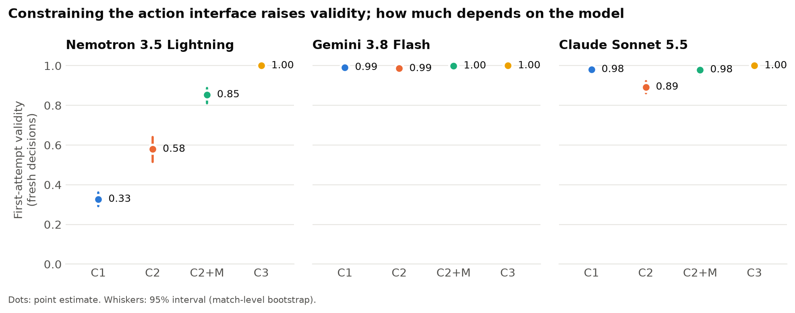
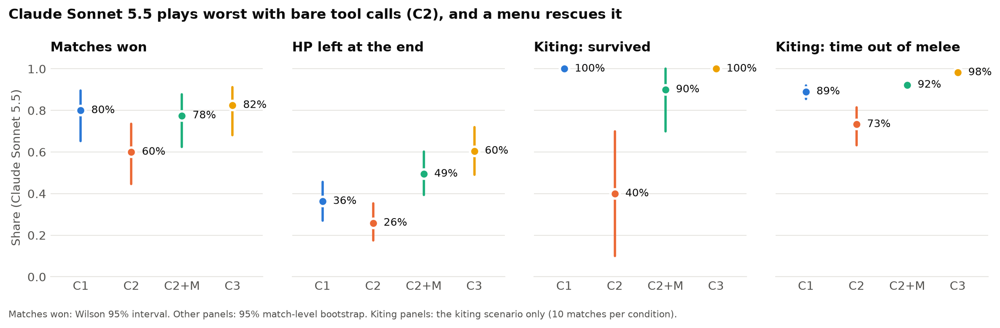
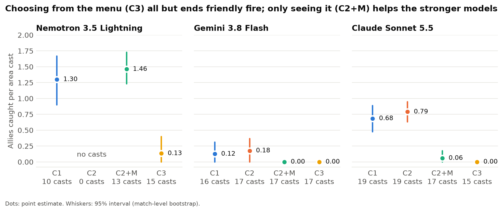

# Show, don't make them guess: how the action interface shapes LLM agents in a tactical game

> **DRAFT, started 2026-10-05.** Built from `FINAL_RUN_FINDINGS.md`, the frozen
> pre-registration and the report in `results/final/report/`.
> - Sections marked **[YOUR VOICE]** are left for the author: notes and facts to draw on
>   are provided, but the words should be yours.
> - Numbers are from the final run unless marked as pilot.
> - Chart slots are marked **[CHART]**; they are drawn from `results/final/report/*.csv`
>   (ledger A11).
> - Target length is 2,500–3,500 words. This draft runs long in places on purpose, so it
>   can be cut.

---

## 1. The problem: models propose, software must preserve invariants  [YOUR VOICE, then the framing below]

**[YOUR VOICE: motivation.]** Why you built this. Notes to draw on:
- You built a D&D combat engine first, for its own sake, and it turned into a test bed.
- The question that made it a study: when an LLM agent acts through tools, how much of
  its failure is the model, and how much is the *interface we hand it*?
- Why it matters beyond games: every production agent proposes actions that software must
  validate: bookings, API calls, database writes.

**Framing (draft).** Tool-using agents fail in two different ways. They choose badly, or
they propose actions the system cannot accept: a target that does not exist, a move into
a wall, a second attack after the first used up the turn. The second kind is often
blamed on the model. But the same model can be asked to act in very different ways. It
can write free text that a parser must interpret. It can fill in a tool call's raw
parameters. Or it can pick from a list of actions the system has already checked are
legal.

That choice belongs to the system's designer, not the model. This study holds the model
fixed and varies only that choice.

## 2. Why a deterministic tactical engine is a good laboratory

- **Every action has a ruling.** The engine implements SRD 5.1 combat. A proposed
  action is either legal or refused, with a typed reason: `destination_blocked`,
  `action_economy_spent`, `out_of_range`, and so on. Validity is *measured*, never
  judged.
- **Everything is reproducible.** All randomness flows through one seeded generator.
  Every match is recorded as a transcript, and replaying the recorded decisions
  reproduces the match exactly. All 600 final matches replay at 100%.
- **Spatial and non-spatial actions mix naturally.** Moving to a point and aiming an area
  spell are open-ended and continuous. Attacking a named target is discrete. That
  contrast is one of the hypotheses (H2).
- **The tactics have real stakes.** Kite a melee brute, protect a fragile ally, place a
  Fireball without hitting your own side.

## 3. Architecture

**[CHART/DIAGRAM: observation → interface → validator → executor → recorder.]**

1. **Observation.** The game state as structured data: positions, HP, resources, and
   each creature's own capabilities. Every condition sees the same body.
2. **Interface (the variable).** How the model expresses an action; see §4.
3. **Validator and executor.** The engine itself. There is one resolution path: the same
   code rules on a free-text command, a tool call or a menu choice.
4. **Recorder.** Every request, response, ruling, token count, the served model and
   host, and (where the provider gives it) the model's reasoning.

A refused action is fed back with the referee's reason, and the model may try again. A
failure budget (3 consecutive or 5 total refusals) ends a turn that goes nowhere.

## 4. The four interface conditions

| Condition | How the model acts | What it sees |
|---|---|---|
| **C1, free text** | One line, `ACTION: attack raider-1 with Longbow`, read by a deterministic grammar | The state |
| **C2, raw tool calls** | `attack(action_name, defender_id)`, `move(x, z)`, … | The state |
| **C2+M, tool calls plus menu** | The same raw tool calls | The state **plus** the list of legal actions |
| **C3, menu choice** | `choose(action_id)` from the list | The state plus the list |

C2+M is the control that makes the design work. It separates *seeing* the options from
*being restricted to* them.

**[YOUR VOICE: "what I decided".]** The design choices worth owning:
- **No LLM parser for C1.** A second model inside the measurement would make failures
  unattributable.
- **Freezing the design before collecting data**, as a pre-registration with a tag.
- **C2+M as a full condition.**
- **The pilot fixed only method bugs, not results.** It found an adjacency bug and a
  free "move nowhere" action, and fixed both. When the strong models solved the
  scenarios, they were *not* made harder.

## 5. Setup and reproducibility

- **Models**, each at the lowest reasoning setting its provider allows, on one pinned
  host, through OpenRouter:

  | Model | Class | Host | Reasoning |
  |---|---|---|---|
  | Nemotron 3.5 Lightning | Small open-weight | CoreWeave | Off |
  | Gemini 3.8 Flash | Fast commercial | Google AI Studio | Low |
  | Claude Sonnet 5.5 | Flagship commercial | Google Vertex | Low |

  These are product classes, not a capability ranking. On a public benchmark, Gemini
  matches Sonnet at equal reasoning effort.
- **Scenarios:** four.
  - `kiting`: an archer against a slower brute
  - `alpha_strike`: a 2v2 melee
  - `protect_squishy`: keep a fragile ally alive
  - `aoe_placement`: a Fireball caster among allies and enemies
- **Opponent:** a fixed scripted agent.
- **Design:** 3 models × 4 conditions × 4 scenarios × 10 paired seeds = 480 matches,
  plus 120 baseline matches.
  - Baselines: random, scripted (a mirror match) and a utility-scoring heuristic.
- **Pre-registered** before any confirmatory data, and tagged `study-freeze`.
  - Hypotheses, metrics, exclusions, decision rules, seeds and prompt hashes were all
    fixed in advance.
  - Every later change is a dated deviation in the pre-registration.
- **Cost and integrity:**
  - 18,023 model decisions, about 31M tokens.
  - $24.30 billed ($29.90 at list price; the difference is prompt caching).
  - No infrastructure exclusions, and 100% replay.

## 6. Results

### 6.1 The headline: constraint buys validity, and how much depends on the model

First-attempt valid-action rate, over fresh decisions:

| Model | C1 | C2 | C2+M | C3 |
|---|---|---|---|---|
| Nemotron 3.5 Lightning | 0.33 | 0.58 | 0.85 | 1.00 |
| Gemini 3.8 Flash | 0.99 | 0.99 | 1.00 | 1.00 |
| Claude Sonnet 5.5 | 0.98 | 0.89 | 0.98 | 1.00 |



- **For the small model, the interface is everything.** Nemotron supports every
  pre-registered hypothesis, with the full ordering C3 > C2+M > C2 > C1, each step
  clear.
  - It wins 13 of 40 matches in C1 and 25 of 40 in C3.
  - In the protection scenario, its fragile ally survives 6 times in 10 under the menu,
    against 1–2 in 10 otherwise.
- **For Gemini, the interface barely matters.** It is valid 99–100% of the time and wins
  82–90% of matches whatever it is given, about the level of the hand-built heuristic
  agent.
- **Sonnet is the interesting one** (§6.3).

**Registered verdicts.** These are the report's paired cluster-bootstrap verdicts over
the 40 shared (scenario, seed) pairs per model. *Supported* means the 95% interval of the
contrast lies entirely above zero.

| Model | H1 (C3 > C2+M > C2 > C1) | H2 (the deficit is spatial) | H3 (constraint buys legality more than tactics) |
|---|---|---|---|
| Nemotron | Supported | Supported | Supported |
| Gemini | Only C2+M > C2 (tiny; ceiling) | Supported (small effect) | Not supported (wins at the ceiling in 3 of 4 scenarios) |
| Sonnet | C3 > C2+M > C2 supported; **C2 < C1, reversed** | Supported | Not supported |

### 6.2 Where validity fails: the taxonomy, not just the rate

Refusals by type tell a different story per model.
- **Nemotron's failures are spatial and bookkeeping errors:**
  - moving onto occupied ground (638 in C1)
  - acting after its action was spent (308 in C1)
  - and, in C2, 754 attempts to "move" to where it already stood
- **Sonnet's C2 failures are almost all bookkeeping:** 56 attacks after its action was
  spent.
- **The menu removes whole categories outright.** C3 had zero refusals of any kind,
  for every model.

Refused decisions by the engine's rejection code, for every cell with any refusals (C3 has
none):

| Model | Condition | Destination blocked | Action spent | Not enough resource | No effect | Out of range | Unknown target |
|---|---|---|---|---|---|---|---|
| Nemotron | C1 | 638 | 308 | 177 | 150 | 82 | 0 |
| Nemotron | C2 | 497 | 40 | 419 | 754 | 5 | 0 |
| Nemotron | C2+M | 0 | 0 | 288 | 60 | 40 | 0 |
| Sonnet | C1 | 21 | 0 | 1 | 0 | 0 | 2 |
| Sonnet | C2 | 36 | 56 | 0 | 0 | 1 | 0 |
| Sonnet | C2+M | 35 | 0 | 0 | 0 | 0 | 0 |
| Gemini | C1 | 9 | 1 | 0 | 0 | 1 | 0 |
| Gemini | C2 | 11 | 5 | 1 | 0 | 0 | 0 |
| Gemini | C2+M | 1 | 0 | 0 | 0 | 0 | 0 |

Validity and effectiveness can come apart.
- In C2, Nemotron is *more* valid than in C1 (0.58 against 0.33) but wins far *less*
  (0.05 against 0.33).
- In C2, 1,460 of its 1,614 fresh decisions were moves. The tool-call format seemed to pull it
  into wandering instead of fighting.

### 6.3 Sonnet: the one condition that hurts it

Sonnet's validity is 0.98 in C1, **0.89 in C2**, 0.98 in C2+M and 1.00 in C3. Its
tactics follow the same shape:

| Sonnet | C1 | C2 | C2+M | C3 |
|---|---|---|---|---|
| Win rate | 0.80 | **0.60** | 0.78 | 0.83 |
| Kiting: archer survives | 10/10 | **4/10** | 9/10 | 10/10 |



Bare C2 is the one condition where the strongest model visibly struggles, and its
failure is specific. Of its 56 refusals for acting with its action already spent, **52
came straight after an attack the engine had just accepted**: it tried to attack a second
time in the same turn. That never happens in C1. It also ends its turn less often in C2
(283 times, against 371 in C1).

Two things rescue it, and they are different:
- **Working it out in the open (C1).** Free text invites prose. Sonnet wrote a line of
  working around **53%** of its C1 commands, against **24–27%** in every other
  condition. That working is spatial bookkeeping, done out loud: "edge to edge that is
  0 ft, so I'm already in melee range".
- **Being shown the options (C2+M and C3).** C2 and C2+M use the *same* tool-call format
  and have the *same* prose rate (26% and 24%). The only difference is the visible list
  of legal actions, and that list takes Sonnet from 0.89 to 0.98 validity and from 4 to
  9 kiting survivals in 10.

**Why Sonnet and not Gemini?** At "low" effort the two vendors do different things.
- Gemini still thinks briefly on almost every turn: ~185–330 output tokens per accepted
  action.
- Sonnet's adaptive thinking judges these turns too simple and mostly skips thinking:
  in the pilot, 19 of 663 requests returned any reasoning.

So the turns that look simple are where Sonnet loses track. The menu and free text each
put back, in different ways, the deliberation it skipped. This is an exploratory reading,
not a registered hypothesis.

**Link to prior work.** This echoes Tam et al. (*Let Me Speak Freely?*, EMNLP 2024): format
restrictions hurt reasoning, not through parsing failures, but by squeezing out the
model's working. Here the restrictive format is the bare tool call. The new observation
is that *showing the legal options* compensates for the lost working, even without
restricting the model to them.

### 6.4 Choosing from the menu ends friendly fire

Allies caught per Fireball cast:

| Model | C1 | C2 | C2+M | C3 |
|---|---|---|---|---|
| Sonnet | 0.68 | 0.79 | 0.06 | 0.00 |
| Gemini | 0.13 | 0.18 | 0.00 | 0.00 |
| Nemotron | 1.30 | — | 1.46 | 0.13 |

Each menu placement lists everyone it would catch, each marked ally or enemy. Gemini and
Sonnet use that list even in C2+M, where they still aim by raw coordinates; Nemotron sees
the same list and still catches 1.46 allies per cast. Only *choosing* from the menu (C3)
ends friendly fire for every model. The number of enemies caught stays roughly the same
throughout (1.4–1.9 per cast). On area spells, then, an enumerated aim does not
cost expressivity, and it *beats* free aiming on the thing that matters most. This
supports a direction for H4b that was revised and registered before the data.



### 6.5 Cost

Dollars per *accepted* action, at list price:
- **For Sonnet, free text is cheapest.** There are no tool definitions in the prompt,
  and few retries: $0.0041 in C1 against $0.0069 in C2.
- **For Gemini, the menu is cheapest** ($0.0019 in C3 against $0.0021 in C1): it writes
  fewer output tokens when choosing from a list (208 per accepted action, against 300).
- **For the weak model, the menu is cheapest by far:** retries are what cost money.
  Nemotron: $0.00012 in C3 against $0.00042 in C2.

### 6.6 Did the parser decide the result?

No, and it was checked twice.
1. **C1 is scored three ways:** a strict reading, the live parser, and a lenient one. All
   three agree exactly for every model, and no response was unreadable.
2. **A blind human audit** of 200 C1 responses found 2 disagreements (1.0%, interval
   0.3–3.6%).
   - Neither is a parser fault: one was a typo in a label, the other a response whose
     reasoning and committed action disagreed.
   - Even at the worst-case error rate, every verdict stands.

**[YOUR VOICE: the audit.]** What labelling 200 responses by hand was like, and noticing
the response whose prose argued for one position and committed to another.

## 7. A failure story: Sonnet, kiting, seed 108

Same model, same seed, same tool-call format. The only difference is whether the legal
actions are listed. An archer (18 HP, 40 ft of movement, a longbow) faces a slower
Bruiser (45 HP, a greatsword). The winning play is to shoot and step back, every turn.

**In C2**, the archer shoots, then tries to shoot again: *refused, action already
spent*. Told why, it retreats. But in rounds 2 and 3 it shoots and **ends its turn
without moving**, and the Bruiser closes the gap. In round 4, with the Bruiser next to
it, it explains itself:

> "The Bruiser is 5.5 ft away, so it's adjacent. I have no opportunity attacks to worry
> about, so I'll kite. First I'll move away to get distance, then shoot next turn. **I
> can't do both in one action, so I'll attack now.**"

Then it shoots and ends its turn, still in melee. It has confused the prompt's rule of
*one tool call per response* with *one action per turn*. From round 5 it moves and
shoots again, but the early damage has been done. The archer dies in round 10 with the
Bruiser on 14 of 45 HP: three turns of standing still cost it the match.

**In C2+M**, the first turn already differs. After shooting, it reads its action count
off the list and doesn't try a second shot: "My action count is 0, so I can't attack this
turn." From round 2 it shoots and then retreats, on almost every turn:

> "Actions are 0, so I can't attack. I'll retreat to keep my distance from the Bruiser and
> stay in longbow range."

It wins in round 16 with 12 of 18 HP. In C3, on the same seed, it wins at full health.

The model did not lack the knowledge: in C2 it said in so many words that it should
kite. What it lacked was a prompt, at the moment it mattered, that options remained. The
menu provided that prompt.

**Watch it.** Both matches ship with the repository. Run `uvicorn web.app:app` and open:

| Moment | Link |
|---|---|
| C2, round 1: the refused second shot | `/playback?match=sonnet_kiting_seed108_C2.jsonl&step=4` |
| C2, round 2: shoots, then ends the turn in place | `/playback?match=sonnet_kiting_seed108_C2.jsonl&step=11` |
| C2, round 4: "I can't do both in one action" | `/playback?match=sonnet_kiting_seed108_C2.jsonl&step=21` |
| C2+M, round 1: "My action count is 0" | `/playback?match=sonnet_kiting_seed108_C2M.jsonl&step=4` |
| C2+M, round 2: shoots, then retreats | `/playback?match=sonnet_kiting_seed108_C2M.jsonl&step=10` |

The source transcripts are
`results/final/anthropic-claude-sonnet-5.5/{C2,C2M}/kiting/seed108.jsonl`, and
`python -m src.arena.study show` prints either one, decision by decision.

**Aside, from the audit.** In C1, Sonnet once reasoned towards moving to (8, 3), then to
(11, 4), and then committed to `move to x=10 z=4`. The parser executed the committed
line, as the rules say. A human could fairly call it ambiguous. Free text gives us
working we can read, and it can disagree with the action.

## 8. Implications for tool-using agents

- **Measure the interface, not just the model.** A single "valid action rate" for a
  model is meaningless without the interface it was given. Here one model ranges from
  33% to 100%.
- **Show what is legal, even if you do not restrict to it.** C2+M, raw tool calls plus a
  visible list, recovered most of the gap for both strong models. Listing the options is
  cheap; enforcing them is optional.
- **Bookkeeping is where capable models slip.** Action economy, remaining resources,
  what is already done. Surfacing state the model must otherwise track helps even
  flagship models.
- **"Low effort" is not one setting.** Vendors implement reasoning effort differently,
  and that changes how an agent behaves on routine steps. Test at the effort you deploy.
- **Small models need structure.** For a small fast model, enumeration was the difference
  between losing most fights and winning most of them.

**[YOUR VOICE: "what surprised me".]** Candidates:
- Sonnet doing worse in C2 than C1.
- The reasoning-effort difference.
- How little the interface mattered to Gemini.
- Nemotron's wandering in C2.
- How cheap a well-run experiment was: about $40 across the pilots and the final run.

## 9. Limitations

- **One environment**, four scenarios, three models, 10 seeds per cell.
- **No multiplicity correction** across the seven contrasts per model. These results are
  robust:
  - Nemotron's ordering
  - Sonnet's C2 reversal
  - the friendly-fire gap

  A single borderline interval (e.g. Gemini's C2+M > C2) is weaker.
- **Exploratory, not registered:** the reasoning-effort explanation, the between-model
  comparison, and Nemotron's wandering.
- **Sampling differs between models.** Only Nemotron ran at temperature 0 with a seed.
  Sonnet accepts neither, and Google advises against lowering Gemini's temperature.
- **Ceiling effects.** Gemini saturates validity and tactics, so H3 is untestable for it.
- **Format and affordance confound.** The menu also carries tactical hints in its labels,
  such as "retreat". C2+M separates seeing from restriction, but not the hint from the
  list.
- **Engine simplifications.** Moves are not blocked by creatures in the way (only by
  where they end), and opportunity attacks are not modelled. Both apply equally to every
  condition.

## 10. Reproduce it

```
pip install -e ".[web,dev,agents]"
python -m src.arena.study run examples/study/demo.toml --out results/demo   # no API key
git checkout study-freeze
python -m src.arena.study verify results/final                              # must be 100%
python -m src.arena.study report results/final
```

The pre-registration is `docs/current/PREREGISTRATION.md` at the `study-freeze` tag. The
release bundle (transcripts, CSVs, prompts and report) is linked from the README.
**[TODO: release link.]**

---

### Still to write or decide

- [ ] The [YOUR VOICE] sections: motivation (§1), what I decided (§4), the audit (§6.6)
      and what surprised me (§8).
- [x] Charts (A11): validity, Sonnet's tactics and friendly fire are in §6 (2026-10-08).
      Refusals by code became a table in §6.2: Nemotron's counts are a hundred times
      the others', so stacked bars would show only Nemotron.
- [ ] Architecture diagram (§3).
- [ ] A replay viewer clip of the seed-108 pair, for §7 and the demo GIF. The
      transcripts and deep links are in place (2026-10-08); capture from those.
- [ ] Cut to 2,500–3,500 words. Candidates to trim: §2, §6.5, and the setup detail in §5.
- [ ] Read *DungeonBench* (arXiv 2607.29577) and place this work relative to it in §1.
- [ ] A title. The working title is a suggestion; alternatives: "The menu is the
      reasoning", "Same model, four interfaces".
