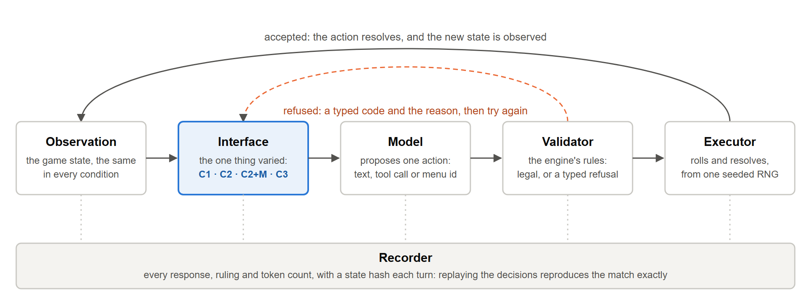

# Show, don't make them guess: how the action interface shapes LLM agents in a tactical game

> **DRAFT, started 2026-10-05.** Built from `FINAL_RUN_FINDINGS.md`, the frozen
> pre-registration and the report in `results/final/report/`.
> - Sections marked **[YOUR VOICE]** are left for the author: notes and facts to draw on
>   are provided, but the words should be yours.
> - Numbers are from the final run unless marked as pilot.
> - Chart slots are marked **[CHART]**; they are drawn from `results/final/report/*.csv`
>   (ledger A11).
> - Target length is 2,500–3,500 words. This draft runs long in places on purpose, so it
>   can be cut.

---

## 1. The problem: models propose, software must preserve invariants

The plan for this project was always to have LLMs interact with an SRD-compatible combat
engine, but the focus was initially far different to what it became. My original vision
was a tool that would simply simulate battles with realistic, well-coordinated tactics,
so that a game master could quickly simulate how an encounter might play out. But while
building it, I realised how many questions there were to answer to get to the point of
an LLM playing the game. And rather than rush a solution, I wanted to explore those
questions.

The first of these, naturally, was how a model interacted with the engine and the world
model. I had heard that the latest paradigm was that the harnesses and interfaces were
far more important than the model itself, but I wanted to test for myself what impact
the interface could have upon the way these models interact with the same underlying
system: where and why they failed, and what influence the interface alone could have
over it.

The setting itself — effectively Dungeons & Dragons combat — was a perfect fit that
I felt I knew well enough to be deeply invested in building and exploring. An
environment that is deterministic for the harness, but full of uncertainty and long-term
planning for the model, which must contend with it solely by making tool calls and
individual decisions from an observation. It mirrors many of the elements of real,
high-stakes use cases for LLMs today, across areas involving autonomous control: a model
that is asked to take action, based on a set of potentially imperfect observations, and
within the confines of what it is able to and permitted to do.

Going in, I expected the interface to prove extremely impactful, as the paradigm
suggested — for each new element introduced to make taking action easier, I anticipated
that there would be a clear payoff visible in the metrics.

Tool-using agents fail by choosing badly, or by proposing actions the system cannot
accept, and the second kind is usually blamed on the model. But how a model may act
(free text for a parser, a tool call's raw parameters, or a pick from a list of actions
already checked as legal) is the designer's choice, not the model's. This study holds
the model fixed and varies only that choice.

**Related work.** The closest work to this one is *DungeonBench* (Ismayilov, Kara and
Oktay, 2026), a far broader benchmark of D&D combat. It covers most of the SRD's combat
rules, links fights into whole adventuring days, and evaluates five frontier models. Its
models always act by choosing from an indexed list of legal options: this study's C3,
and the same contract D20Bench uses. It appeared in July, and I found it only while
verifying citations at the freeze, so the two designs converged independently. That is
no surprise, given how popular D&D is and how simple its combat is next to other
tabletop games. I suspect we are the same kind of enthusiast, each wanting to try our
own ideas for LLMs and D&D.

I see it as a complement, not a competitor. DungeonBench goes broad, across the rules
and across a whole day of play; this study goes deep on the one design decision it holds
fixed. Nothing in it challenges the results here, and the results here support its
choice: the menu was the most reliable interface tested, for every model. But they also
show that the choice shapes the scores and how the models behave, so a benchmark's
numbers are partly a property of its interface. Its much finer movement enumeration is
an idea I would like to try in future, with care to balance resolution against a list
too long to be useful.

## 2. Architecture



Every proposed action is either legal or refused with a typed reason
(`destination_blocked`, `action_economy_spent`, `out_of_range`, …), so validity is
*measured*, never judged. A refused action is fed back with the referee's reason, and
the model may try again. A failure budget (3 consecutive or 5 total refusals) ends a
turn that goes nowhere.

## 3. The four interface conditions

| Condition | How the model acts | What it sees |
|---|---|---|
| **C1, free text** | One line, `ACTION: attack raider-1 with Longbow`, read by a deterministic grammar | The state |
| **C2, raw tool calls** | `attack(action_name, defender_id)`, `move(x, z)`, … | The state |
| **C2+M, tool calls plus menu** | The same raw tool calls | The state **plus** the list of legal actions |
| **C3, menu choice** | `choose(action_id)` from the list | The state plus the list |

C2+M is the control that makes the design work. It separates *seeing* the options from
*being restricted to* them.

**What I decided, and why.** Avoiding an LLM parser for C1 was a clear and important
decision to me, despite it being initially considered. The heart of that choice was
simple: a non-deterministic factor parsing the model's action would leave doubt about
whether the outcome was solely because of the interface itself, or influenced by the LLM
performing parsing. This want for authenticity was carried into the way the study was
carried out, and my choice to pre-register and freeze the project was guided by a strong
trust in the scientific method. I truly believe that regardless of the scope or
importance of a study, it will benefit from an honest, proper methodology.

I realised that I needed to add the fourth interface condition of C2+M when first seeing
a chart of what each of the first three interfaces contained, and noting that there were
distinctly two changes between C2 and C3 — the menu, and the action selection format. If
one were to prove superior, I realised I could not truly be sure which of these two
changes had caused it, and to what extent, so a middle ground was necessary.

When I realised during the pilot that Gemini had all but solved the four scenarios, I
chose not to change them for honesty and to value the answer that it came with: for a
powerful enough LLM, in a simple enough setting, the interface barely matters — it will
find the way. That is a finding in itself, and making the scenarios harder would have
only been likely to degrade the results for the other two models which had not solved
them. Ultimately, it was not a study on how hard of a scenario it took to confound the
models.

I felt proudest about how neutral and fair I feel the menus are, particularly when
offering AoE targeting: unique sets of targets are provided, but little guidance on what
the model actually wants to hit. Beyond naming its moves, nowhere does a menu
truly guide the model to do something more clever — it is only by having its options
laid out plainly that Sonnet was seen to perform distinctly better when provided with
it, despite doing little reasoning of its own.

## 4. Setup and reproducibility

- **Models**, each at the lowest reasoning setting its provider allows, on one pinned
  host, through OpenRouter:

  | Model | Class | Host | Reasoning |
  |---|---|---|---|
  | Nemotron 3.5 Lightning | Small open-weight | CoreWeave | Off |
  | Gemini 3.8 Flash | Fast commercial | Google AI Studio | Low |
  | Claude Sonnet 5.5 | Flagship commercial | Google Vertex | Low |

  These are product classes, not a capability ranking.
- **Scenarios:** `kiting` (an archer against a slower brute), `alpha_strike` (a 2v2
  melee), `protect_squishy` (keep a fragile ally alive) and `aoe_placement` (a Fireball
  caster among allies and enemies), each against a fixed scripted opponent.
- **Design:** 3 models × 4 conditions × 4 scenarios × 10 paired seeds = 480 matches,
  plus 120 baseline matches (random, scripted and a utility-scoring heuristic).
- **Pre-registered** before any confirmatory data and tagged `study-freeze`:
  hypotheses, metrics, exclusions, decision rules, seeds and prompt hashes. Every later
  change is a dated deviation in the pre-registration.
- **Cost and integrity:** 18,023 model decisions and about 31M tokens; $24.30 billed
  ($29.90 at list price, the difference being prompt caching); no infrastructure
  exclusions, and 100% replay.

## 5. Results

### 5.1 The headline: constraint buys validity, and how much depends on the model

First-attempt valid-action rate, over fresh decisions:

| Model | C1 | C2 | C2+M | C3 |
|---|---|---|---|---|
| Nemotron 3.5 Lightning | 0.33 | 0.58 | 0.85 | 1.00 |
| Gemini 3.8 Flash | 0.99 | 0.99 | 1.00 | 1.00 |
| Claude Sonnet 5.5 | 0.98 | 0.89 | 0.98 | 1.00 |


- **For the small model, the interface is everything.** Nemotron supports every
  pre-registered hypothesis, with the full ordering C3 > C2+M > C2 > C1, each step
  clear.
  - It wins 13 of 40 matches in C1 and 25 of 40 in C3.
  - In the protection scenario, its fragile ally survives 6 times in 10 under the menu,
    against 1–2 in 10 otherwise.

**Registered verdicts.** These are the report's paired cluster-bootstrap verdicts over
the 40 shared (scenario, seed) pairs per model. *Supported* means the 95% interval of the
contrast lies entirely above zero.

| Model | H1 (C3 > C2+M > C2 > C1) | H2 (the deficit is spatial) | H3 (constraint buys legality more than tactics) |
|---|---|---|---|
| Nemotron | Supported | Supported | Supported |
| Gemini | Only C2+M > C2 (tiny; ceiling) | Supported (small effect) | Not supported (wins at the ceiling in 3 of 4 scenarios) |
| Sonnet | C3 > C2+M > C2 supported; **C2 < C1, reversed** | Supported | Not supported |

### 5.2 Where validity fails: the taxonomy, not just the rate

Refusals by type tell a different story per model.
- **Nemotron's failures are spatial and bookkeeping errors:**
  - moving onto occupied ground (638 in C1)
  - acting after its action was spent (308 in C1)
  - and, in C2, 754 attempts to "move" to where it already stood
- **Sonnet's C2 failures are almost all bookkeeping:** 56 attacks after its action was
  spent.
- **The menu removes whole categories outright.** C3 had zero refusals of any kind,
  for every model. (Every count is in the report's `summary.md`.)

Validity and effectiveness can come apart.
- In C2, Nemotron is *more* valid than in C1 (0.58 against 0.33) but wins far *less*
  (0.05 against 0.33).
- In C2, 1,460 of its 1,614 fresh decisions were moves. The tool-call format seemed to
  pull it into wandering instead of fighting.

### 5.3 Sonnet: the one condition that hurts it

Sonnet's validity is 0.98 in C1, **0.89 in C2**, 0.98 in C2+M and 1.00 in C3. Its
tactics follow the same shape:

| Sonnet | C1 | C2 | C2+M | C3 |
|---|---|---|---|---|
| Win rate | 0.80 | **0.60** | 0.78 | 0.83 |
| Kiting: archer survives | 10/10 | **4/10** | 9/10 | 10/10 |


Bare C2 is the one condition where the flagship model visibly struggles, and its
failure is specific. Of its 56 refusals for acting with its action already spent, **52
came straight after an attack the engine had just accepted**: it tried to attack a second
time in the same turn. That never happens in C1.

Two things rescue it, and they are different:
- **Working it out in the open (C1).** Free text invites prose. Sonnet wrote a line of
  working around **53%** of its C1 commands, against **24–27%** in every other
  condition. That working is spatial bookkeeping, done out loud: "edge to edge that is
  0 ft, so I'm already in melee range".
- **Being shown the options (C2+M and C3).** C2 and C2+M use the *same* tool-call format
  and have the *same* prose rate (26% and 24%). The only difference is the visible list
  of legal actions, and that list takes Sonnet from 0.89 to 0.98 validity and from 4 to
  9 kiting survivals in 10.

**Why Sonnet and not Gemini?** At "low" effort Gemini still thinks briefly on almost
every turn, while Sonnet's adaptive thinking mostly skips it: in the pilot, 19 of 663
requests returned any reasoning. The menu and free text each put back, in different
ways, the deliberation it skipped. This is an exploratory reading, not a registered
hypothesis.

**Link to prior work.** This echoes Tam et al. (*Let Me Speak Freely?*, EMNLP 2024):
format restrictions hurt reasoning by squeezing out the model's working, not through
parsing failures. Here the restrictive format is the bare tool call, and the new
observation is that *showing* the legal options compensates, even without restricting
the model to them.

### 5.4 What the menu costs, and what it buys (H4)

A menu can only offer the options someone thought to list. That cost was measured
before any model ran (H4a), across the positions real matches pass through. The aim
menu reaches at least 75% of the distinct sets of creatures a Fireball could catch
(median 92%). The movement menu, a few named destinations per creature (close in,
retreat, kite to range), reaches as little as **33%** of the positions free movement
can. So the menu should cost a little on area spells and a lot on movement. It did
neither.

**Area spells: choosing from the menu all but ends friendly fire.** Allies caught per
Fireball cast:

| Model | C1 | C2 | C2+M | C3 |
|---|---|---|---|---|
| Sonnet | 0.68 | 0.79 | 0.06 | 0.00 |
| Gemini | 0.13 | 0.18 | 0.00 | 0.00 |
| Nemotron | 1.30 | — | 1.46 | 0.13 |

Each menu placement lists everyone it would catch, each marked ally or enemy. Gemini and
Sonnet use that list even in C2+M, where they still aim by raw coordinates; Nemotron sees
the same list and still catches 1.46 allies per cast. Only *choosing* from the menu (C3)
all but ends friendly fire for every model: Gemini and Sonnet catch no allies, and
Nemotron 2 in 15 casts. The number of enemies caught stays roughly the same
throughout (1.4–1.9 per cast). On area spells, then, an enumerated aim does not
cost expressivity, and it *beats* free aiming on the thing that matters most. This
supports a direction for H4b that was revised and registered before the data.


**Movement: the menu kited best.** The registered prediction was that C3 would do no
better than free movement here. Kiting is the scenario that rewards movement most, and
its score is the share of the match the archer spends out of melee (10 matches per
cell):

| Kiting: time out of melee | C1 | C2 | C2+M | C3 |
|---|---|---|---|---|
| Nemotron | 0.18 | 0.15 | 0.72 | 0.76 |
| Gemini | 0.98 | 0.98 | 0.98 | 0.98 |
| Sonnet | 0.89 | 0.73 | 0.92 | 0.98 |

For every model, C3 kites at least as well as any condition with free movement. In C3,
Sonnet kites exactly as well as the hand-built heuristic agent (0.98, and 16.1 of 18 HP
left on average), which Gemini matches in every condition. The menu's positions are few,
but "step back to range" is one of them, and that is the move kiting needs.

So the loss H4a measured is real, but these scenarios never needed the positions the menu
lost. A scenario that rewards one precise spot, such as a flank, a doorway or cover,
would test it properly, and none of the four does. H4 has no registered decision rule,
so this is a description rather than a verdict.

### 5.5 Cost

Per accepted action at list price, free text is cheapest for Sonnet ($0.0041 against
$0.0069 in C2): its prompt carries no tool definitions, and it rarely retries. For the
other two the menu is cheapest: Gemini writes fewer output tokens when choosing from a
list, and Nemotron stops paying for retries ($0.00012 in C3 against $0.00042 in C2).

### 5.6 Did the parser decide the result?

No, and it was checked twice. C1 is scored three ways (a strict reading, the live
parser and a lenient one), and all three agree exactly for every model; no response
was unreadable. A blind human audit of 200 C1 responses found 2 disagreements (1.0%,
interval 0.3–3.6%), neither a parser fault: one was a typo in a label, the other a
response whose reasoning and committed action disagreed. Even at the worst-case error
rate, every verdict stands.

**Doing the audit.** Labelling 200 responses was a mix of tedious and interesting,
solely based on which model I was labelling. Sonnet's reasoning prose was interesting to
read and occasionally quite charming, while labelling plain tool calls was fairly tedious
after dozens of very similar labels. Blind labelling definitely felt different, however,
because I fully believed the parser to be infallible. Were it to have made a genuine
mistake, or in the case where Sonnet's reasoning was inconsistent but its action properly
formatted, I would have been too likely to not question it had I been able to see the
parser's label. Finding that one of the two disagreements was my own error felt mildly
annoying, but ultimately was a mark of honest human labelling.

Overall, the experience did change my views of free text as an interface in a small way.
I had assumed that any form of free response would be plagued by inconsistent wording
causing parser errors, so I was pleasantly surprised to find how well even the weakest
model adopted the simple action syntax.

## 6. A failure story: Sonnet, kiting, seed 108

Same model, same seed, same tool-call format. The only difference is whether the legal
actions are listed. An archer (18 HP, 40 ft of movement, a longbow) faces a slower
Bruiser (45 HP, a greatsword). The winning play is to shoot and step back, every turn.

**In C2**, the archer shoots, then tries to shoot again: *refused, action already
spent*. Told why, it retreats. But in rounds 2 and 3 it shoots and **ends its turn
without moving**, and the Bruiser closes the gap. In round 4, with the Bruiser next to
it, it explains itself:

> "The Bruiser is 5.5 ft away, so it's adjacent. I have no opportunity attacks to worry
> about, so I'll kite. First I'll move away to get distance, then shoot next turn. **I
> can't do both in one action, so I'll attack now.**"

Then it shoots and ends its turn, still in melee. It has confused the prompt's rule of
*one tool call per response* with *one action per turn*. From round 5 it moves and
shoots again, but the early damage has been done. The archer dies in round 10 with the
Bruiser on 14 of 45 HP: three turns of standing still cost it the match.

**In C2+M**, the first turn already differs. After shooting, it reads its action count
off the list and doesn't try a second shot: "My action count is 0, so I can't attack this
turn." From round 2 it shoots and then retreats, on almost every turn:

> "Actions are 0, so I can't attack. I'll retreat to keep my distance from the Bruiser and
> stay in longbow range."

It wins in round 16 with 12 of 18 HP. In C3, on the same seed, it wins at full health.

The model did not lack the knowledge: in C2 it said in so many words that it should
kite. What it lacked was a prompt, at the moment it mattered, that options remained. The
menu provided that prompt.

**Watch it.** Both matches ship with the repository. In a clone, run
`uvicorn web.app:app` and open
`http://localhost:8000/playback?match=sonnet_kiting_seed108_C2.jsonl&step=21` for
the "I can't do both" turn. **[TODO: the GIF of the pair, once recorded.]**

## 7. Implications for tool-using agents

- **Measure the interface, not just the model.** A single "valid action rate" for a
  model is meaningless without the interface it was given. Here one model ranges from
  33% to 100%.
- **Show what is legal, even if you do not restrict to it.** C2+M, raw tool calls plus a
  visible list, recovered most of the gap for both strong models. Listing the options is
  cheap; enforcing them is optional.
- **Bookkeeping is where capable models slip.** Action economy, remaining resources,
  what is already done. Surfacing state the model must otherwise track helps even
  flagship models.

**What surprised me.** The result that surprised me the most was, without a doubt, that
Sonnet performed worse with bare tool calls than free text. The only instance of a model
becoming less reliable as the interface became more structured came from the model I
believed to be the best, which was greatly unexpected, and the way it lost track of what
it had already done was not a regression I had considered would occur.

Gemini, on the other hand, completely exceeded my expectations. To find that it hardly
mattered which interface it got was almost worrying, before I accepted that it does not
harm the study as a whole.

It goes without saying that I also could not have expected how strikingly different
"low" reasoning actually is between vendors, to the degree that Sonnet skipped it
entirely most of the time while Gemini only tried to keep it short.

So did the idea that the interface matters more than the model hold up? It depended
entirely on the model: for Nemotron it held emphatically, for Gemini it barely applied,
and for Sonnet it mattered only when the interface took away both its room to reason and
its view of the options.

## 8. Limitations

- **One environment**, four scenarios, three models, 10 seeds per cell.
- **No multiplicity correction** across the seven contrasts per model. Nemotron's
  ordering, Sonnet's C2 reversal and the friendly-fire gap are robust to it; a single
  borderline interval, such as Gemini's C2+M > C2, is weaker.
- **Exploratory, not registered:** the reasoning-effort explanation, the between-model
  comparison, and Nemotron's wandering.
- **Sampling and reasoning differ between models.** Only Nemotron ran at temperature 0
  with a seed. Sonnet accepts neither, and Google advises against lowering Gemini's
  temperature. And "low" reasoning effort means a different amount of thinking per
  vendor (§5.3), so the between-model comparison mixes capability with both.
- **One neutral prompt.** Every condition shares a prompt that scripts no tactics, and it
  was not tuned to any model. A prompt engineered for each model might narrow the gaps.
- **Menu discretisation.** The movement menu reaches as little as a third of the
  positions free movement can (§5.4), and no scenario rewards a precise position, so
  that cost is measured but untested.
- **Ceiling effects.** Gemini saturates validity and tactics, so H3 is untestable for it.
- **Format and affordance confound.** The menu also carries tactical hints in its labels,
  such as "retreat". C2+M separates seeing from restriction, but not the hint from the
  list.
- **Engine simplifications.** Moves are not blocked by creatures in the way (only by
  where they end), and opportunity attacks are not modelled. Both apply equally to every
  condition, but they make escaping in the positioning scenarios easier than the rules
  intend.
- **One author.** The same person built the engine, the interfaces and the scenarios.
  The pre-registration and the blind parser audit limit how much that can shape the
  results, but do not remove it.

## 9. Reproduce it

```
pip install -e ".[web,dev]"
python -m src.arena.study run examples/study/demo.toml --out results/demo   # no API key
# download the data bundle (below) and unzip it into the repository root, then:
python -m src.arena.study verify results/final   # must be 100%
python -m src.arena.study report results/final   # rebuilds the report byte for byte
```

The data is [`arbiter-arena-study-1.0.0.zip`](https://github.com/Nitrix119/Arbiter-Arena/releases/download/v1.0.0/arbiter-arena-study-1.0.0.zip), from the
[v1.0.0 release](https://github.com/Nitrix119/Arbiter-Arena/releases/tag/v1.0.0): every transcript, the report, the blind audit, each
condition's exact prompt, and the pre-registration both as frozen at the
`study-freeze` tag and as it stands with its dated deviations.

---

### Still to write or decide

- [x] The [YOUR VOICE] sections: motivation (§1), what I decided (§4), the audit (§6.7)
      and what surprised me (§8). Written by interview, 2026-10-10: the author's answers,
      with spelling, grammar and approved accuracy fixes only.
- [x] H4 (2026-10-10): the movement side, which had gone unreported, is §6.5. The
      limitations now cover every threat declared in prereg §9.
- [x] Charts (A11): validity, Sonnet's tactics and friendly fire are in §6 (2026-10-08).
      Refusals by code became a table in §6.2: Nemotron's counts are a hundred times
      the others', so stacked bars would show only Nemotron.
- [x] Architecture diagram (§3): `docs/figures/architecture.{svg,png}` (2026-10-10).
- [ ] A replay viewer clip of the seed-108 pair, for §7 and the demo GIF. The
      transcripts and deep links are in place (2026-10-08); capture from those.
- [x] Cut to 2,500–3,500 words (2026-10-11, cuts A–L, approved by the author). The
      old §2 is folded into Architecture, so every later section moved up one; the
      section numbers in the items above are from before the cut.
- [x] Read *DungeonBench* (arXiv 2607.29577) and place this work relative to it in §1
      (2026-10-10, "Related work").
- [ ] A title. The working title is a suggestion; alternatives: "The menu is the
      reasoning", "Same model, four interfaces".
